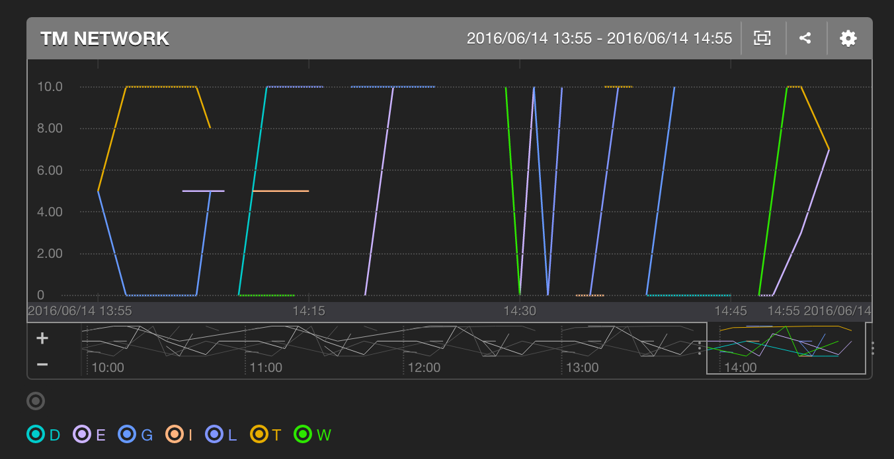

# mackerel-plugin-getwild

# Description

This program draws _GET WILD_ on Mackerel.

# Add mackerel-agent.conf

Finally, if you want to get linux metrics via Mackerel, please edit mackerel-agent.conf. For example is below.

[plugin.metrics.getwild]
command = "mackerel-plugin-getwild.rb"
